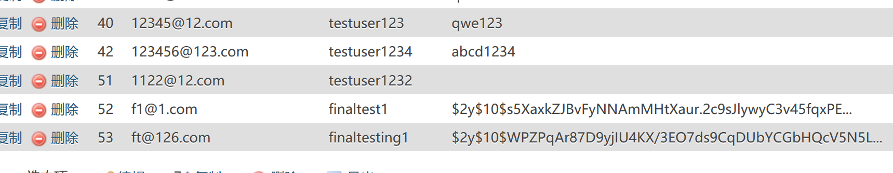

#Web基础应用 PJ2开发文档

**吴逸昕 19302010013**

------------

### 1. Github地址

Github：https://github.com/Shadowlized/PJ2/

------------
### 2. 项目完成情况

本项目基础功能已全部实现。
            
-------------
### 3. Bonus完成情况

#### 3.1 哈希加盐

使用了Phpstorm自带方法实现：
```
$hash = password_hash($password,PASSWORD_DEFAULT);
```
以上放在注册页，`$password`为所需加密的密码，`PASSWORD_DEFAULT`为加密算法。

```
$valid = password_verify($password,$hash);
```
以上放在登录页，此处`$password`为用户登录时所输入的密码，`$hash`为从数据库上读取的注册时保存的加密后密码；该方法返回一个布尔值。



#### 3.2 前端框架

使用了Bootstrap实现了首页轮播图效果

#### 3.3 服务器部署

用的ubuntu系统，ip地址47.103.30.187，域名已注册www.shadowlized.cn正在审理备案中，花了十几二十个小时，装了yum以及一系列配套的，装了mysql并上传了数据库，装了apache，在/var/www/html里放置了测试用的index.html，也在/etc/apache2底下修改了很多.conf文件，不过不知道哪里出了问题，httpd未能正常安装，php7_module is already loaded无法解决，最后用127.0.0.1/目录名以及47.103.30.187/index.html还是未能成功显示，用navicat测试连接也是cannot connect to mysql server on localhost……（希望能有几分辛苦分，非常感谢）

---------------

### 4. 意见与建议

本次PJ有点全程围绕数据库展开了，初期着实难以下手…然后服务器部署的话或许给个大致方向大致步骤会好一些？搜出来的方法各不相同，做的时候十分迷茫不知道该按哪个做